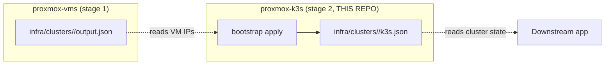

# proxmox-k3s

Stage-2 of the proxmox provisioning pipeline. Takes the 2 VMs that
[`proxmox-vms`](../proxmox-vms) cloned from the `ubuntu-noble-template`
and turns them into a fully working k3s cluster:

- **k3s** (v1.36.x, stable channel, `--disable-kube-proxy` so cilium
  owns ClusterIP routing).
- **Cilium** (1.19.5) — CNI + kube-proxy-replacement via eBPF.
- **proxmox-cloud-controller-manager** (0.14.0) — sets
  `providerID` + `topology.kubernetes.io/{region,zone}` on every node.
- **proxmox-csi-plugin** (0.19.1) — provisions PVCs as lvm-thin
  volumes on `data1`.
- **strrl/cloudflare-tunnel-ingress-controller** (0.0.23) — public
  ingress via a Cloudflare Tunnel.
- **cert-manager** (v1.16.2) — in-cluster CA.
- **Envoy Gateway** (v1.8.2) + Gateway API CRDs (v1.6.0, standard
  channel).

All version pins live in [versions.yaml](versions.yaml) +
[tools/versions.lock.yaml](tools/versions.lock.yaml).

## The SOLID refactor

This repo is a deliberate refactor of the
[`proxmox-k8s-cicd/tools/bootstrap_cluster.py`](../proxmox-k8s-cicd/tools/bootstrap_cluster.py)
(1,801-line god module) into SOLID-compliant modules:

| Principle | How |
|---|---|
| **SRP** | Each Phase is one file under `provisioner/lib/phases/` |
| **OCP** | New Phase = `@register` decorator + import |
| **LSP** | Every Phase is substitutable (`run(ctx) -> PhaseResult`) |
| **ISP** | Phases depend on narrow Protocols (`RemoteExecutor`, `ClusterProbe`, etc.) |
| **DIP** | `Container` wires concrete impls; phases see only Protocols |

See [docs/architecture.md](docs/architecture.md) for the full design.

## How it fits the pipeline



## Quickstart

```sh
# 1. Copy the .env from proxmox-vms (same secrets) and add CF_API_TOKEN + CF_ACCOUNT_ID.
cp ../proxmox-vms/.env .env

# 2. Validate the cluster root + proxmox-vms output.json are readable.
make validate CLUSTER=cicd

# 3. Plan: diff desired vs live cluster (no changes).
make plan CLUSTER=cicd

# 4. Apply: install k3s + all the helm charts.
make apply CLUSTER=cicd

# 5. Repeat 4 any time; the bootstrap is idempotent (state in bootstrap_state.json).
make apply CLUSTER=cicd
```

## Installation

This repo exposes two CLIs:

| Command | Module | Purpose |
|---|---|---|
| `bootstrap` | `provisioner.cli` | Run the k3s + helm install against a cluster |
| `pveproxy` | `tools.pveproxy` | Operator-side tunnel + kubectl wrapper |

Install both via `uv tool install` (recommended) or `pipx`:

```sh
# from a local clone (dev install; tracks your working tree)
uv tool install .

# from the repo URL (pin a tag or branch)
uv tool install git+https://github.com/bruj0/proxmox-k3s

# upgrade later
uv tool upgrade proxmox-k3s

# uninstall
uv tool uninstall proxmox-k3s
```

`uv tool install` puts both binaries on `~/.local/bin` (already
on `PATH` for most shells). Verify:

```sh
bootstrap --help
pveproxy --help
```

If you'd rather not install globally, you can run them from the
repo checkout directly:

```sh
python -m provisioner --help     # equivalent to `bootstrap --help`
python -m tools.pveproxy --help  # equivalent to `pveproxy --help`
```

## Operator CLI: `pveproxy`

The operator host is **not** on the SDN, and k3s binds its
apiserver to the CP node's loopback. So the only path from
`kubectl` on the operator host to the cluster is:

```
operator:127.0.0.1:<local>
   <- ssh -L through PVE ->
CP node:127.0.0.1:6443
```

`pveproxy` owns that tunnel's lifecycle. One command per intent:

| Subcommand | What it does |
|---|---|
| `start`   | Open the tunnel and write a kubeconfig for the cluster. **Never starts the tunnel twice** — if one is already listening, it refreshes the kubeconfig and reprints state without spawning a second ssh process. |
| `stop`    | Tear the tunnel down and clear the state file. |
| `status`  | Print tunnel state (`pid`, `local_port`, `target`, `started_at`). Exits non-zero if the tunnel is stale. |
| `restart` | `stop` then `start`. |
| `kubeconfig` | Print the path to the kubeconfig file (use `--print` for `$(...)` substitution). |
| `kubectl -- ARGS` | Run `kubectl` against the cluster. Auto-starts the tunnel if it's not already up. |

State lives in `infra/clusters/<name>/.pveproxy.state.json` and the
kubeconfig lands at `infra/clusters/<name>/kubeconfig.pveproxy`.
Both are git-ignored (the kubeconfig holds the live CA + token).

Typical workflow:

```sh
# 1. From anywhere on the operator host, after `make apply` has succeeded:
pveproxy --cluster cicd start

# 2. Run kubectl, helm, k9s, etc. against the tunneled kubeconfig:
pveproxy --cluster cicd kubectl -- get nodes -o wide
pveproxy --cluster cicd kubectl -- -n kube-system get pods

# Or grab the kubeconfig path and use your own tooling:
export KUBECONFIG=$(pveproxy --cluster cicd kubeconfig --print)
kubectl get nodes
helm list -A

# 3. Check what's running:
pveproxy --cluster cicd status

# 4. Tear it down when done:
pveproxy --cluster cicd stop
```

`pveproxy start` resolves the cluster's control-plane IP from
either `output.json` (stage-1's artefact, cicd repo) or `k3s.json`
(stage-2's, written by the bootstrap). Override with
`--repo-root /path/to/repo` if the tool can't auto-discover the
repo from your cwd.

## Why pure-Python (no tofu)?

`proxmox-vms` runs the cluster root through `tofu apply` because PVE
VM creation is best expressed declaratively. This repo doesn't need
that: every phase is either an SSH call (`install_k3s`,
`ssh_probe`) or an in-cluster `helm` / `kubectl` call. Python's
stdlib gives us everything we need without dragging in a state
backend, a tofu module, or a 30-second `tofu init`.

## SSH architecture

The cluster VMs live on a private SDN behind the PVE host. The
operator can SSH only to the PVE host on port 6022 (the
`root@kvm.bruj0.net:6022` jump box). The bootstrap uses SSH
`ProxyCommand` (from user-memory `ssh-tunnel-python.md`) to chain:

```
operator -> root@kvm.bruj0.net:6022 (PVE) -> ubuntu@<vm-ip>:22 (k3s node)
```

## Tests

```sh
make test     # 73 tests, all mock-based (no live SSH/helm/kubectl)
make lint     # ruff + mypy --strict
```

The mock-based tests prove the SOLID design works: every Phase is
testable in isolation via `Container.for_tests(...)`, which wires
`FakeRemoteExecutor` + `FakeClusterProbe` + `InMemoryStateStore` +
`DictOutputSink` + `StaticVersionsSource` + `StaticSecretsSource`.
The vendored cicd tests (log, pve_ssh, versions, secret_loader,
repo_locator) all pass too.

## Output

After `make apply`, the cluster root gets a `k3s.json`:

```json
{
  "cluster_name": "cicd",
  "k3s_version": "v1.36.2+k3s1",
  "api_endpoint": "https://10.0.0.64:6443",
  "pod_cidr": "172.16.0.0/16",
  "svc_cidr": "172.17.0.0/16",
  "cluster_dns": "172.17.0.10",
  "nodes": [
    {"role": "control_plane", "name": "cicd-cp-1", "vmid": 300, "ip": "10.0.0.64"},
    {"role": "worker",        "name": "cicd-w-1",  "vmid": 301, "ip": "10.0.0.65"}
  ],
  "helm_releases": [
    {"name": "cilium", "namespace": "kube-system", "version": "1.19.5"},
    {"name": "proxmox-cloud-controller-manager", "namespace": "kube-system", "version": "0.14.0"},
    ...
  ],
  "smoke": {
    "nodes_ready": true,
    "cilium_pods_running": 2,
    "csi_driver_registered": true,
    ...
  }
}
```

See [docs/architecture.md](docs/architecture.md) for the SOLID
justification and dependency diagram, and [docs/PLAN.md](docs/PLAN.md)
for the original plan.