# proxmox-k3s — Plan

> Status: **Plan (2026-07-09)**. No code written yet. This document is
> the operator-facing design for the new `proxmox-k3s` repo. Once
> approved, each numbered work package (WP) is implemented and
> pinned by a test before the next one starts.

## 1. What this repo is

`proxmox-k3s` is the second stage of a two-stage provisioning
pipeline. **Stage 1** is `proxmox-vms` (which already exists, see
`/home/bruj0/projects/proxmox/proxmox-vms/`): it clones 2 VMs from
the `ubuntu-noble-template` on Proxmox and writes
`infra/clusters/<name>/output.json` with their live IPs.
**Stage 2** is this repo: it takes those 2 VMs and turns them into
a fully working k3s cluster (CNI = Cilium, CCM + CSI = proxmox
plug-ins, ingress = Cloudflare Tunnel, cert-manager, OpenGateway /
Envoy Gateway API), then writes its own `output.json` for downstream
apps to consume.

The repos are siblings by design: the operator runs them in
sequence, never in parallel, and each one's `output.json` is the
next one's input contract.

```mermaid
%%{ init: { 'flowchart': { 'curve': 'linear' } } }%%
flowchart LR
  subgraph proxmox-vms["proxmox-vms (stage 1)"]
    Tofu1["tofu apply<br/>(infra/clusters/cicd)"]
    Orch1["provisioner apply"]
    Out1["infra/clusters/cicd/output.json<br/>{name, vmid, ip}"]
    Tofu1 --> Orch1 --> Out1
  end

  subgraph proxmox-k3s["proxmox-k3s (stage 2, THIS REPO)"]
    Orch2["bootstrap.py apply cicd"]
    K3s["install k3s on cicd-cp-1<br/>(server + node-token)"]
    Helm["helm install:<br/>cilium, proxmox-ccm,<br/>proxmox-csi, cloudflare-tunnel,<br/>cert-manager, envoy-gateway"]
    Out2["infra/clusters/cicd/k3s.json<br/>{api_endpoint, helm_releases, node_ips}"]
    Orch2 --> K3s --> Helm --> Out2
  end

  Downstream["Downstream app<br/>(k3s-aware)"]
  Out1 -. "reads VM IPs" .-> Orch2
  Out2 -. "reads cluster state" .-> Downstream
  classDef stage1 fill:#7c3aed,color:#fff
  classDef stage2 fill:#1e3a8a,color:#fff
  classDef out fill:#dcfce7,stroke:#166534,color:#0f172a
  classDef down fill:#be185d,color:#fff
  class Tofu1,Orch1 stage1
  class Orch2,K3s,Helm stage2
  class Out1,Out2 out
  class Downstream down
```



## 2. The shape of the repo (mirrors `proxmox-k8s-cicd`)

```
proxmox-k3s/
├── AGENTS.md                 -- guide for AI agents modifying this repo
├── Makefile                  -- operator entry points (plan, apply, destroy, etc.)
├── README.md
├── pyproject.toml
├── versions.yaml             -- master compatibility matrix (component -> version -> source)
├── versions.lock.yaml        -- pinned versions + provenance for the bootstrapper
├── docs/
│   ├── PLAN.md               -- this file
│   ├── architecture.md       -- subsystem boundaries (SS0 tokens, SS1 image, SS2 vms, SS3 cluster)
│   ├── idempotency.md        -- what "apply again" does on a steady-state cluster
│   └── runbooks/
│       ├── rotate-csi-token.md
│       └── decommission-cluster.md
├── infra/
│   ├── modules/
│   │   └── proxmox-k3s/      -- one reusable Tofu module: writes Helm values, renders manifests
│   └── clusters/
│       ├── cicd/             -- thin instantiation (locals + module)
│       └── apps/             -- second instantiation
├── provisioner/              -- Python orchestrator (mirrors proxmox-vms/provisioner)
│   ├── __init__.py
│   ├── __main__.py
│   ├── cli.py                -- `bootstrap plan|apply|destroy|validate`
│   └── lib/
│       ├── log.py            -- StructuredLogger (redacts token/secret/password keys)
│       ├── pve_ssh.py        -- stdlib SSH + ProxyCommand (per the user-memory ssh-tunnel pattern)
│       ├── ssh_runner.py     -- `run(cmd, host, user, key)` with stdout/stderr capture
│       ├── k3s_installer.py  -- `install_server()`, `install_agent()`, `read_node_token()`
│       ├── kubeconfig_puller.py -- scp /etc/rancher/k3s/k3s.yaml from the CP, merge into ~/.kube/config
│       ├── helm_runner.py    -- `helm repo add`, `helm template`, `helm upgrade --install`
│       ├── kubectl_runner.py -- `kubectl apply --server-side -f -`
│       ├── topology_writer.py-- builds infra/clusters/<name>/k3s.json
│       ├── planner.py        -- live-state-vs-desired diff (idempotency)
│       └── versions.py       -- reads versions.yaml + versions.lock.yaml
└── tests/
    ├── conftest.py
    ├── fixtures/
    │   ├── versions.yaml
    │   ├── versions.lock.yaml
    │   └── output.json       -- the proxmox-vms output.json shape
    ├── test_log.py
    ├── test_planner.py
    ├── test_versions.py
    ├── test_k3s_installer.py     -- dry-run; no live SSH
    ├── test_helm_runner.py
    ├── test_kubectl_runner.py
    ├── test_topology_writer.py
    ├── test_output_writer.py
    └── test_tofu_log_capture.py  -- same pattern as proxmox-vms
```

## 3. Component versions (the canonical pin set)

The numbers below are written into `versions.yaml` and `versions.lock.yaml`.
The planner refuses to apply if the live cluster disagrees with the lock
(except where noted).

| Component | Version | Source | Where installed |
|---|---|---|---|
| k3s | `v1.36.2+k3s1` (stable channel) | `https://get.k3s.io` | `curl -sfL https://get.k3s.io \| INSTALL_K3S_EXEC='...' sh -` |
| cilium | `1.19.5` (current stable, matches the docs.cilium.io page) | `quay.io/cilium/cilium-cli` (CLI) + `https://helm.cilium.io` (chart) | `cilium install --version 1.19.5 --set=ipam.operator.clusterPoolIPv4PodCIDRList="<pod_cidr>"` |
| proxmox-cloud-controller-manager (PCCM) | `0.14.0` (latest release) | `oci://ghcr.io/sergelogvinov/charts/proxmox-cloud-controller-manager` | `helm upgrade -i pccm oci://ghcr.io/sergelogvinov/charts/proxmox-cloud-controller-manager --version 0.14.0 -n kube-system` |
| proxmox-csi-plugin | `0.19.1` (latest release; requires PVE `CSI` role) | `oci://ghcr.io/sergelogvinov/charts/proxmox-csi-plugin` | `helm upgrade -i proxmox-csi-plugin oci://ghcr.io/sergelogvinov/charts/proxmox-csi-plugin --version 0.19.1 -n csi-proxmox` |
| cloudflare-tunnel (controller) | `0.0.23` (matches the cicd repo pin) | `oci://ghcr.io/strrl/charts/cloudflare-tunnel-ingress-controller` (NOTE: chart name confirmed against the cicd repo; verify with `helm show` at apply time) | `helm upgrade -i cloudflare-tunnel oci://ghcr.io/strrl/charts/cloudflare-tunnel-ingress-controller --version 0.0.23 -n cloudflare-tunnel` |
| cert-manager | `v1.16.x` (broadly compatible with Cilium 1.19) | `oci://quay.io/jetstack/charts/cert-manager` | `helm upgrade -i cert-manager oci://quay.io/jetstack/charts/cert-manager --version v1.16.2 -n cert-manager` |
| envoy-gateway (Envoy Gateway API) | `v1.8.2` (matches the gateway.envoyproxy.io docs page) | `oci://docker.io/envoyproxy/gateway-helm` | `helm install eg oci://docker.io/envoyproxy/gateway-helm --version v1.8.2 -n envoy-gateway-system --create-namespace` |
| Gateway API CRDs | `v1.6.0` (standard channel) | `https://github.com/kubernetes-sigs/gateway-api/releases/download/v1.6.0/standard-install.yaml` | `kubectl apply --server-side -f <url>` (before cilium install) |
| helm | `>= 3.18.0` | https://helm.sh | preinstalled on the operator host |
| kubectl | `>= 1.34.0` | https://kubernetes.io | preinstalled on the operator host |
| python | `>= 3.11` | https://python.org | preinstalled on the operator host |

> **Provenance**: every `version` above is a quote from a public
> release page or install doc fetched on 2026-07-09 (cited in the
> row). The full audit trail lives in `versions.lock.yaml` (one
> entry per component with `source: <url>` and `fetched: <date>`).

## 4. Cluster identity (locals per cluster root)

Each `infra/clusters/<name>/main.tf` declares its cluster identity
in `locals` (mirroring `proxmox-vms/infra/clusters/{cicd,apps}/main.tf`):

```hcl
locals {
  cluster_name = "cicd"
  pod_cidr     = "172.16.0.0/16"   # cicd uses 172.16, apps uses 172.20
  svc_cidr     = "172.17.0.0/16"   # cicd uses 172.17, apps uses 172.21
  cluster_dns  = "172.17.0.10"     # must be inside svc_cidr
  k3s_version  = "v1.36.2+k3s1"    # pinned in versions.lock.yaml
  install_k3s_exec_server = [
    "--flannel-backend=none",      # Cilium owns routing
    "--disable-kube-proxy",
    "--disable=traefik",           # Cloudflare Tunnel is the ingress
    "--disable=servicelb",
    "--disable=local-storage",     # proxmox-csi-plugin is the storage
    "--disable=metrics-server",
    "--kubelet-arg=cloud-provider=external",
    "--cluster-cidr=${local.pod_cidr}",
    "--service-cidr=${local.svc_cidr}",
    "--cluster-dns=${local.cluster_dns}",
  ]
  install_k3s_exec_agent = [
    "--kubelet-arg=cloud-provider=external",
  ]
  ccm_namespace   = "kube-system"
  csi_namespace   = "csi-proxmox"
  csi_storage     = "data"          # PVE storage ID
  csi_region      = "Region-1"      # matches proxmox-csi config region
  cf_tunnel_name  = "cicd"          # matches proxmox-vms cluster
  cf_api_token    = var.cf_api_token
  tags            = ["proxmox-k3s", "cicd"]
}
```

`--flannel-backend=none` and `--disable-kube-proxy` are critical: per
[the Cilium k3s install guide](https://docs.cilium.io/en/stable/installation/k3s/),
Cilium replaces kube-proxy in this mode and we MUST pass
`--disable-kube-proxy` so k3s doesn't try to start a second routing
plane that fights with Cilium's eBPF maps.

## 5. The `provisioner` (Python orchestrator)

Mirrors `proxmox-vms/provisioner/` 1:1. The CLI surface is:

```
bootstrap plan    <cluster>     # diff desired vs live cluster (no mutations)
bootstrap apply   <cluster>     # run all phases; idempotent
bootstrap destroy <cluster>     # remove the cluster's workloads + VMs (calls into proxmox-vms)
bootstrap validate <cluster>    # parse main.tf, check versions, no mutations
```

All subcommands follow the same lifecycle as the proxmox-vms
provisioner:

1. Load `.env` (PROXMOX_API_URL, PROXMOX_API_TOKEN, CF_API_TOKEN, etc.).
2. Parse the cluster root's `main.tf` (stdlib HCL parser — same
   pattern as `proxmox-vms/provisioner/lib/hcl_parser.py`).
3. Read `infra/clusters/<cluster>/output.json` from the sibling
   `proxmox-vms` repo to get the VM IPs.
4. Read `versions.lock.yaml` to get the component pins.
5. Run the orchestrator. Every `tofu` / `helm` / `kubectl` / `ssh`
   call is captured to `logs/<subcommand>_<cluster>_<utc>.log`
   (same pattern as proxmox-vms: section header per call, streamed
   to terminal, recorded in the JSONL audit log).

### 5.1 Idempotency model

The planner (`provisioner/lib/planner.py`) builds a `Plan` by
diffing the desired cluster (from `main.tf` + `versions.lock.yaml`)
against the live cluster (queried via `kubectl get`):

| Desired | Live | Action |
|---|---|---|
| k3s server not installed | k3s server not installed | `install_server` |
| k3s server installed, agent not joined | both | `install_agent` |
| k3s server + agent installed | k3s server + agent installed | `noop` (still re-apply Helm releases; `helm upgrade --install` is idempotent) |
| Cilium 1.19.5 installed | Cilium 1.18.x installed | `helm upgrade cilium 1.19.5` (helm diff says version drift) |
| Cilium 1.19.5 installed | Cilium 1.19.5 installed | `noop` |
| PCCM chart release present, version `0.14.0` | PCCM chart release `0.13.0` | `helm upgrade pccm --version 0.14.0` |
| CSI chart release present, version `0.19.1` | CSI chart release `0.19.1` | `noop` |

A re-run on a steady-state cluster is a guaranteed no-op apart from
the `kubectl get` / `helm list` probes and the `output.json` rewrite.

### 5.2 Phases (the apply subcommand)

The `apply` subcommand runs 6 phases in order, mirroring
`proxmox-k8s-cicd/tools/bootstrap_cluster.py`. Each phase is
independently skippable with `--phases`.

| # | Phase | What it does | Idempotency check |
|---|---|---|---|
| 1 | `ssh_probes` | SSH to each VM; verify `cloud-init status` is `done` and `systemctl is-active qemu-guest-agent` is `active`. | `systemctl is-active` |
| 2 | `k3s_server` | Run `curl -sfL https://get.k3s.io \| INSTALL_K3S_EXEC='...' sh -` on the control-plane VM. | `test -f /etc/rancher/k3s/k3s.yaml` |
| 3 | `k3s_agent` | scp the node-token from the server, then `curl ... \| K3S_URL=... K3S_TOKEN=... sh -` on the worker. | `test -f /etc/rancher/k3s/agent/etc/k3s-agent.yaml` |
| 4 | `kubectl_baseline` | Apply Gateway API CRDs v1.6.0 standard channel via `kubectl apply --server-side -f <url>`. | `kubectl get crd gateways.gateway.networking.k8s.io` |
| 5 | `helm_releases` | `cilium install` (CLI), then `helm upgrade --install` for: pccm, proxmox-csi-plugin, cloudflare-tunnel, cert-manager, envoy-gateway. | `helm list -A` |
| 6 | `topology_writer` | Build `infra/clusters/<name>/k3s.json` with the api endpoint, per-node IPs, list of helm releases, and a smoke-test status block. | (always runs) |

### 5.3 `output.json` shape (the SS3 handoff)

Mirrors the cicd repo's `output.json` (so downstream apps can read
either repo's output with the same parser):

```json
{
  "cluster_name": "cicd",
  "k3s_version": "v1.36.2+k3s1",
  "api_endpoint": "https://10.0.0.64:6443",
  "pod_cidr": "172.16.0.0/16",
  "svc_cidr": "172.17.0.0/16",
  "cluster_dns": "172.17.0.10",
  "nodes": [
    {"role": "control_plane", "name": "cicd-cp-1", "vmid": 300, "ip": "10.0.0.64"},
    {"role": "worker",        "name": "cicd-w-1",  "vmid": 301, "ip": "10.0.0.65"}
  ],
  "helm_releases": [
    {"name": "cilium",                     "namespace": "kube-system",     "version": "1.19.5"},
    {"name": "proxmox-cloud-controller-manager", "namespace": "kube-system", "version": "0.14.0"},
    {"name": "proxmox-csi-plugin",         "namespace": "csi-proxmox",     "version": "0.19.1"},
    {"name": "cloudflare-tunnel",          "namespace": "cloudflare-tunnel", "version": "0.0.23"},
    {"name": "cert-manager",               "namespace": "cert-manager",    "version": "v1.16.2"},
    {"name": "eg",                         "namespace": "envoy-gateway-system", "version": "v1.8.2"}
  ],
  "smoke": {
    "nodes_ready": true,
    "cilium_pods_running": 2,
    "csi_driver_registered": true,
    "cert_manager_ready": true,
    "envoy_gateway_available": true
  }
}
```

## 6. Idempotency in detail (the tricky bits)

The three places that will bite an operator if I'm not careful:

1. **`kubectl apply` is not idempotent for CRDs.** Standard-channel
   Gateway API CRDs are not safe to re-apply via `kubectl apply` (the
   apiserver rejects "no changes" for CRD schema changes). I will use
   `kubectl apply --server-side --force-conflicts` and pin the
   manifest URL + version in `versions.lock.yaml`. Re-running on a
   steady-state cluster is a no-op because the apiserver returns
   "no changes" for unchanged resources.

2. **`helm upgrade --install` is idempotent but `helm install` is
   not.** Every helm release must be installed with
   `helm upgrade --install <name> <chart> --version <v> -n <ns>
   --create-namespace` — never plain `helm install`. The orchestrator
   helper `helm_runner.py` enforces this.

3. **k3s's built-in upgrade controller will roll forward
   automatically** after the install. I will NOT disable the
   upgrade controller (that would freeze the cluster at the
   install version, which is rarely what the operator wants).
   The `versions.lock.yaml` records the install version as
   provenance; a future apply that sees a drifted version will
   log a warning, not refuse.

## 7. Work packages (WPs)

Ordered for review-and-implement:

| WP | Title | Est. effort | Depends on |
|---|---|---|---|
| WP01 | Scaffold the repo: AGENTS.md, README.md, Makefile, pyproject.toml, .gitignore, versions.yaml, versions.lock.yaml | 1 hr | — |
| WP02 | `provisioner/lib/log.py` (lifted from proxmox-vms, 1:1) | 30 min | WP01 |
| WP03 | `provisioner/lib/ssh_runner.py` + `pve_ssh.py` (SSH + ProxyCommand pattern, user-memory note) | 2 hr | WP02 |
| WP04 | `provisioner/lib/hcl_parser.py` (lifted from proxmox-vms) | 1 hr | WP02 |
| WP05 | `provisioner/lib/versions.py` (reads versions.yaml + versions.lock.yaml) | 1 hr | WP01 |
| WP06 | `provisioner/lib/k3s_installer.py` (install_server, install_agent, read_node_token) — dry-run by default | 3 hr | WP03, WP05 |
| WP07 | `provisioner/lib/kubectl_runner.py` (apply manifests with --server-side) | 1 hr | WP03 |
| WP08 | `provisioner/lib/helm_runner.py` (repo add, upgrade --install) | 2 hr | WP03 |
| WP09 | `provisioner/lib/topology_writer.py` (writes infra/clusters/<name>/k3s.json) | 1 hr | WP02 |
| WP10 | `provisioner/lib/planner.py` (idempotency diff against live cluster) | 3 hr | WP06, WP07, WP08, WP09 |
| WP11 | `provisioner/cli.py` (plan / apply / destroy / validate subcommands; tofu-log capture from proxmox-vms carried over) | 3 hr | WP10 |
| WP12 | `infra/modules/proxmox-k3s/` Tofu module: writes the per-cluster `k3s.json` snapshot, renders helm values | 2 hr | WP05 |
| WP13 | `infra/clusters/cicd/` + `infra/clusters/apps/` instantiations | 1 hr | WP12 |
| WP14 | Live-host apply on the cicd cluster (the cluster that already exists from proxmox-vms); verify all 6 phases + output.json | 2 hr | WP13 |
| WP15 | Live-host apply on the apps cluster | 1 hr | WP14 |
| WP16 | Tests (pytest, mypy --strict, ruff) + the `tofu test` for the module | 2 hr | WP11 |

Total: ~25 hours.

## 8. What I am NOT doing (by design)

- **No k3s upgrade automation.** k3s's built-in controller handles
  that. We pin the install version, we don't freeze the cluster.
- **No Cilium policy authoring.** The user said "install Cilium";
  default `cilium install` is fine. Network policies are a
  downstream-app concern.
- **No Cloudflare-side setup.** The `cloudflare-tunnel` controller
  runs in the cluster and needs a Cloudflare API token. We read
  the token from `infra/tokens/output.json` (or the user's `.env`)
  and pass it to the helm values. The Cloudflare tunnel + DNS
  records are the controller's job.
- **No apps-cluster cross-cluster ExternalNames.** That's a
  downstream app's job; we just hand them the cluster's `k3s.json`.
- **No Talos / no Sidero / no Packer.** The cluster is built on
  the Ubuntu Noble template that proxmox-vms already baked.

## 9. Risks and how I'm going to handle them

| Risk | Mitigation |
|---|---|
| **Live k3s install fails mid-flight** (e.g. k3s service won't start) | `k3s_installer.py` captures `/var/log/k3s.log` from the CP and dumps it to the tofu log. The `output.json` is NOT written if any phase failed. |
| **Helm chart registry is down at apply time** | `helm_runner.py` retries 3 times with exponential backoff. After 3 failures, the apply aborts and the audit log records the registry URL that failed. |
| **The proxmox-vms output.json doesn't exist** (stage 1 was never run) | `_check_prerequisites` fails with `prereq_failed` and exit code 2; the audit log records the missing file path. The operator is told to run `make apply CLUSTER=<name>` in proxmox-vms first. |
| **The proxmox-vms output.json is stale** (the VM was re-IP'd by DHCP after a reboot) | The bootstrapper re-queries the live IPs from the `proxmox-vms` output.json at apply time AND verifies them via SSH (if SSH succeeds, the IP in output.json is current). |
| **A second apply races the first** (two operators run `bootstrap apply` simultaneously) | The audit log's `trace_id` is unique per invocation; if the second apply sees the first's helm release in `helm list`, it skips the install and only does the IP re-check. Worst case: both succeed and one wins on the k8s-side idempotency. |

## 10. The plan as a single sentence

Spin up a 2-node k3s cluster on the two Proxmox VMs that
proxmox-vms already cloned, install Cilium (kube-proxy-free) +
proxmox-cloud-controller-manager + proxmox-csi-plugin +
cloudflare-tunnel-ingress-controller + cert-manager + Envoy
Gateway v1.8.2 via helm, write `infra/clusters/<name>/k3s.json`
with the live cluster state, and be safe to re-run any number of
times.
