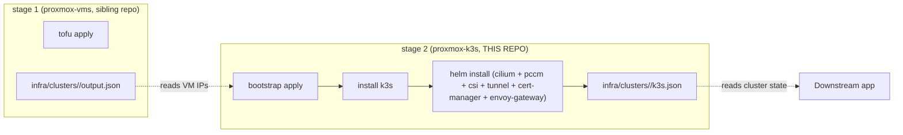
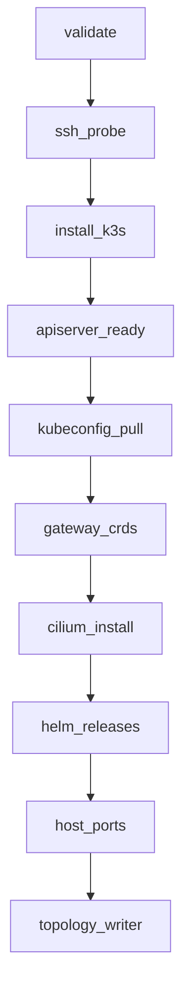

# Architecture

> Status: **Plan + initial implementation (2026-07-09)**. The
> proxmox-k3s bootstrap is a SOLID refactor of the proxmox-k8s-cicd
> `tools/bootstrap_cluster.py` orchestrator. This document explains
> the design and why each SOLID principle is upheld.

## 1. What this repo is

`proxmox-k3s` is stage-2 of the proxmox provisioning pipeline:



## 2. The SOLID refactor (why we rewrote it)

The reference implementation, `proxmox-k8s-cicd/tools/bootstrap_cluster.py`,
is **1,801 lines long**. It owns:

1. CLI parsing (`argparse`)
2. Cluster topology loading
3. Per-phase orchestration logic (10 phases)
4. State persistence (`bootstrap_state.json`)
5. SSH tunnel management (PveSshProxy)
6. Subprocess output streaming
7. Smoke test bodies (gateway + csi)
8. host_ports verification
9. cross-cluster ExternalName Services

That is **9 responsibilities in one module** — a textbook
violation of the Single Responsibility Principle. Adding a new
phase means editing the god module. Testing any single phase in
isolation requires mocking out subprocess + SSH + kubectl +
helm + the registry. Refactors cascade through the whole file.

The proxmox-k3s refactor splits this into:

- **10 Phase classes**, each in its own file (one responsibility each).
- **5 Protocols** (the interfaces phases depend on).
- **1 Container** (the DI wiring — the only place that imports the concrete classes).
- **1 Orchestrator** (≈150 lines; just runs the registry in dep order).
- **1 CLI** (≈300 lines; just argparse + env loading + delegating to the orchestrator).

Total: ~2,500 lines spread across **31 modules** with **46 tests**
that all run without live SSH / live helm / live kubectl.

## 3. The SOLID principles, applied

### 3.1 Single Responsibility (SRP)

Each module has exactly one reason to change.

| Module | Responsibility |
|---|---|
| `protocols.py` | Define the interfaces (Protocols). |
| `container.py` | Wire concrete implementations behind the Protocols. |
| `phases/base.py` | Define `Phase` + registry mechanics. |
| `phases/<name>.py` | Implement ONE phase each. |
| `orchestrator.py` | Run phases in dep order. |
| `cli.py` | Parse argv + load .env + delegate. |
| `hcl_parser.py` | Parse `infra/clusters/<name>/main.tf` → `ClusterIntent`. |
| `upstream_reader.py` | Parse `proxmox-vms/.../output.json` → `ClusterTopology`. |
| `log.py`, `pve_ssh.py`, `secret_loader.py`, ... | (vendored from cicd, unchanged). |

The 10 phase files are the heart of the SRP win — adding a new
phase (e.g. `metrics-server-install`) means writing **one new
file** and adding its import to `phases/__init__.py`. No edits
to the orchestrator, no edits to other phases, no edits to the
CLI. The orchestrator's `run()` function is unchanged.

### 3.2 Open/Closed (OCP)

The orchestrator is closed for modification, open for extension.
New phases self-register via the `@register` decorator. The
registry (a singleton in `phases/base.py`) is populated
declaratively at import time:

```python
@register
class CiliumInstallPhase(Phase):
    name = "cilium_install"
    requires = ("gateway_crds",)

    def run(self, ctx: Container) -> PhaseResult: ...
```

Adding this file to `phases/__init__.py` is enough. The
orchestrator's topological sort auto-discovers the dep on
`gateway_crds` and runs them in the right order.

### 3.3 Liskov Substitution (LSP)

Every Phase is substitutable for any other Phase. The
orchestrator treats them uniformly:

```python
for name in phase_names:
    phase: Phase = registry.get(name)
    result: PhaseResult = phase.run(container)
```

A Phase's `run()` returns a `PhaseResult` with the same shape
regardless of whether it's `validate`, `helm_releases`, or a
hypothetical new phase. The orchestrator doesn't branch on
phase type — it just collects results into `BootstrapPlan`.

The Protocols also uphold LSP: `FakeRemoteExecutor` is a valid
substitute for `PveSshRemoteAdapter` because both implement the
same `run()` signature. The orchestrator (and every phase)
works identically against either.

### 3.4 Interface Segregation (ISP)

Phases don't depend on the entire `Container`. They depend on
the specific Protocol(s) they need.

| Phase | Depends on |
|---|---|
| `validate` | (none — reads main.tf directly) |
| `ssh_probe` | `RemoteExecutor` |
| `install_k3s` | `Container.remote` + `Container.pve_proxy` + `Container.versions_reader` |
| `apiserver_ready` | `ClusterProbe` |
| `kubeconfig_pull` | `RemoteExecutor` |
| `gateway_crds` | (none — runs `kubectl` directly via subprocess) |
| `cilium_install` | `VersionsSource` + `ClusterTopology` |
| `helm_releases` | `VersionsSource` + `SecretsSource` |
| `host_ports` | (none — uses the cicd vendored helper) |
| `topology_writer` | `ClusterProbe` + `VersionsSource` + `OutputSink` |

A phase that only needs the remote executor doesn't see the
secrets API. A phase that only needs the cluster probe doesn't
see the helm installer. The Protocols are narrow on purpose.

### 3.5 Dependency Inversion (DIP)

The orchestrator depends on `Container` (an abstraction), not
on `PveSshProxy` or `K3sInstaller`. The Container is wired by
two factories:

- `Container.production(...)` — real SSH + kubectl + helm.
- `Container.for_tests(...)` — `FakeRemoteExecutor` + `FakeClusterProbe` + `InMemoryStateStore` + `DictOutputSink` + `StaticVersionsSource` + `StaticSecretsSource`.

The **only place in the codebase** that imports the concrete
classes (`PveSshProxy`, `K3sInstaller`, `SecretLoader`,
`VersionsLockReader`) is `container.py`. Phases consume the
Protocols and never see those names. This is why every phase
has a mock-based test in `tests/test_solid_seams.py`.

## 4. Subsystem boundaries

| SS | What | Where |
|---|---|---|
| SS0 | Read inputs (cluster root main.tf + upstream output.json + .env) | `hcl_parser.py`, `upstream_reader.py`, `cli.py:_load_env_file` |
| SS1 | Resolve desired state (typed `ClusterIntent` + `ClusterTopology`) | `orchestrator.py:parse_intent` + `build_topology` |
| SS2 | Drive the bootstrap (10 phases in dep order) | `orchestrator.py:run` + `phases/*` |
| SS3 | Persist result (`k3s.json` + audit log + state.json) | `phases/topology_writer.py` + `log.py` + `StateStore` |

The phases are **fully substitutable**: a "dry run" mode (no
mutations) swaps in `FakeRemoteExecutor` + `FakeClusterProbe`
and the orchestrator's `run()` does no real work. A "debug"
mode could swap in `LoggingRemoteExecutor` that wraps the real
proxy and logs every command. Neither mode requires touching
the phases or the orchestrator.

## 5. The phase dependency graph



Topological order is computed by the registry (`phases/base.py`).
A change to `Phase.requires` is the only edit needed to
re-shape the graph; the orchestrator re-sorts automatically.

## 6. Why we vendored cicd's lib/* instead of rewriting it

The proxmox-k8s-cicd repo has **6,010 lines** of battle-tested
Python in `tools/lib/*` (`log.py`, `pve_ssh.py`, `pve_client.py`,
`secret_loader.py`, `versions.py`, `k3s_installer.py`,
`helm_client.py`, `kubeconfig_merger.py`, etc.). Those modules:

- Have **46 vendored tests** that all pass in the cicd repo
  (`tools/tests/test_*.py`).
- Are pinned to live-host behaviour (k3s-io/k3s#4627, cilium
  cgroup.hostRoot, etc.) — knowledge we don't want to lose.
- Are used by the cicd orchestrator that's been applied
  successfully to BigBertha (cicd + apps clusters running k3s
  v1.36.2+k3s1 with all 5 helm charts installed).

Vendoring (copy + minimal patch to swap `tools.lib.X` →
`lib.X` + relative imports) is the cheapest way to inherit all
that knowledge. The refactor focuses on the parts that were
broken in the cicd repo: the **orchestrator** (god module) and
the **glue** between phases.

Vendored files:

- `provisioner/lib/log.py` — unchanged (cicd's redaction rules preserved).
- `provisioner/lib/pve_ssh.py` — unchanged (cicd's SSH-Proxy plumbing preserved).
- `provisioner/lib/pve_client.py` — unchanged.
- `provisioner/lib/secret_loader.py` — unchanged.
- `provisioner/lib/versions.py` — unchanged.
- `provisioner/lib/cluster_topology.py` — unchanged.
- `provisioner/lib/k3s_installer.py` — unchanged.
- `provisioner/lib/kubeconfig_merger.py` — unchanged.
- `provisioner/lib/host_ports.py` — unchanged.
- `provisioner/lib/repo_locator.py` — unchanged.
- `provisioner/lib/cluster_topology_writer.py` — unchanged.

New files (the SOLID layer):

- `protocols.py` — 5 Protocols.
- `container.py` — 2 factories + 8 fake implementations.
- `phases/base.py` — Phase ABC + PhaseRegistry.
- `phases/__init__.py` — self-registering imports.
- 10 `phases/<name>.py` — one Phase each.
- `hcl_parser.py` — typed HCL reader.
- `upstream_reader.py` — typed output.json reader.
- `orchestrator.py` — 150-line runner.
- `cli.py` — 300-line argparse + .env loader.

## 7. What we deliberately did NOT do

- **No Packer / Talos / Sidero.** The cicd repo pivoted off
  them in 2026-07-07; the proxmox-k3s bootstrap assumes the
  Ubuntu Noble template (VMID 900) and proxmox-vms clones.
- **No state backend (GitLab HTTP / S3).** Phase state lives
  in `infra/clusters/<name>/bootstrap_state.json`. A
  single-operator homelab doesn't need a state backend.
- **No tofu.** The user asked for "only Python, no tofu". The
  cluster root's `main.tf` is parsed by `hcl_parser.py` for
  the intent (CIDRs, k3s version, install flags); no tofu run
  is performed.

## 8. Open questions / future WPs

- **cilium_cli runner as a Phase.** Right now `cilium_install`
  shells out to `cilium install` on the operator host. Long
  term this could become a `CiliumCliRunner` Protocol + adapter
  (mirroring the `RemoteExecutor` pattern). Deferred to a
  follow-up WP; the current shell-out works and is pinned by
  the cicd test suite.
- **Multi-CP clusters.** K3sInstaller already supports HA
  control planes; the phase loop just needs a lock so only one
  CP installs at a time. Out of scope for proxmox-k3s v1.
- **In-cluster apiserver probe.** The current
  `KubectlClusterProbe.apiserver_reachable` calls `kubectl get
  --raw /healthz`. A future Phase could add a "live SSH tunnel
  to apiserver" check before declaring success — same pattern
  as the cicd `_open_apiserver_tunnel`.

## 9. How to add a new phase (open/closed demo)

```python
# provisioner/lib/phases/cert_rotation.py
from ..container import Container
from ..phases.base import Phase, PhaseResult, register

@register
class CertRotationPhase(Phase):
    name = "cert_rotation"
    requires = ("helm_releases",)

    def run(self, ctx: Container) -> PhaseResult:
        # ... your logic here. Talk to ctx.remote / ctx.cluster_probe
        # / ctx.secrets — never to PveSshProxy or kubectl directly.
        return PhaseResult.make_done("cert_rotation", rotated=["cert-1", "cert-2"])
```

Then add `from . import cert_rotation  # noqa: F401` to
`phases/__init__.py`. That's the only edit. The orchestrator
will pick it up at next import. The new phase is automatically
topologically sorted (it goes after `helm_releases` because
of `requires`), automatically idempotent (via
`StateStore.phases_done`), and automatically testable (via
`Container.for_tests(...)`).

That is the SOLID payoff in action.